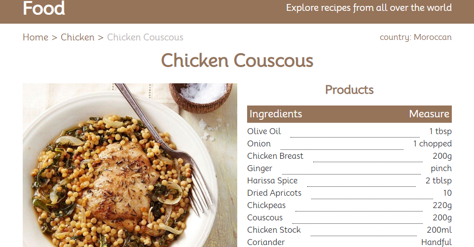

# <a name='nav'>Food</a>

Это учебное приложение, написанное с использованием React и React Router. Вы можете посмотреть демо-версию приложения на [GitHub Pages по этой ссылке](https://voverg.github.io/react-food 'Посмотреть демо-версию')

- [Описание](#description)

---

## <a name='description'>Описание</a>
Приложение "Food":
- Приложение использует открытое API [The meal DB](https://themealdb.com/api.php) с информацией о рецептах
- В приложении есть каталог с категориями рецептов
- Можно заходить в разные категории, выбирать нужный рецепт и смотреть подробную информацию по нему

[Назад к заглавию](#nav)
